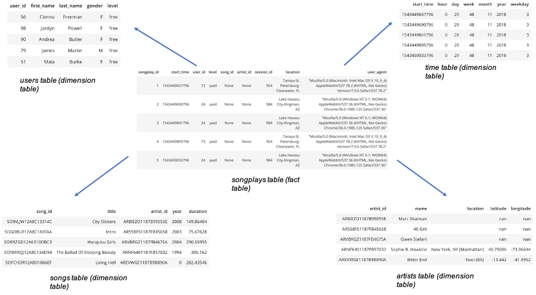

# Purpose of this database and expected analytical goals

Sparkify is a startup which owns a music streaming app, and the company wants to have a better understanding of their clients and the songs they listen to, in order to grow. 
However, the files needed for these analyses are stored in json log files, and it is not difficult to do analyses with these files.

That's why we need to create this database to give the business analysts a tool to easily and quickly analyze the behaviours of their customers, 
so that they can know their customers better, give them a better user experience, and thus grow their business. 

With the database, we can do a lot of descriptive analysis pretty easily like counting the number of users, their gender, how many of them are using a paid account, 
how many songs do they listen per day on average, etc... 

 We can also do more elaborate things with the database. For example, with the history of song plays of each user, we can build a recommendation engine to recommend songs best suited for each user.

# Description of the database schema design and ETL pipeline

The database is designed in a star schema, which means that we have one main fact table (the songplays table) and 4 dimensions tables (users, songs, artists and time). This design is opted here because with this design, we don't need to do complicated queries to have the information we need. 

More precisely, we can quickly query the most important and interesting information on the fact table itself (without any join), and if we want some more precisions, we can join with the corresponding dimension table to have that information (as we have 4 dimension tables, with 4 joins we can access all the available informations).

Here is an illustration of the tables and the star schema : 



Regarding the ETL pipeline, we are extracting informations stored in the log files in json format, process them to extract the information we need and put them in the correct format, and then load them into a postgres database. As the format of our data is not going to change a lot, and we don't have a big amount of data, a relational database like PostgreSQL is a good choice.

# How to create and populate the database ?

To create the database, open a terminal and change the directory to this directory.
Once you're here, make sure that there are no other sessions running, and then run the following command :

```bash
python create_tables.py
```

This will create the tables that we need. Then, run the following command :

```bash
python etl.py
```

This will extract the informations from the log files and insert them to the tables created previously.

Once the database has been created and populated correctly, you can run the queries you want, and some examples are given to you below.

# Examples of queries

Here are some example queries and their results for song play analysis :

Get the number of users :
~~~~sql
SELECT COUNT(DISTINCT user_id) FROM songplays;

Result: 96
~~~~

So there are 96 users in our database.

Get the gender of the users :
~~~~sql
SELECT gender, COUNT(DISTINCT songplays.user_id) 
FROM songplays 
JOIN users 
ON songplays.user_id = users.user_id 
GROUP BY gender

Result:
gender count
F      55
M      41
~~~~

There are thus 55 female users and 41 male users.

# Detailed files description

**sql_queries.py** : python scripts which contains the sql queries to create the 5 tables, drop the tables, and insert data into these tables.
It also contains one query to find a song given its title and the name of the artist => to check

**create_tables.py** : python script which creates the Postgres database, and which uses the queries defined in the module sql_queries.py to drop the tables and create the tables.

**etl.py** : python scripts which contains the functions to read, process and load the song files and the log files in the Postgres database.

**Test_ETL.ipynb** : notebook which check that the ETL pipeline is working correctly
